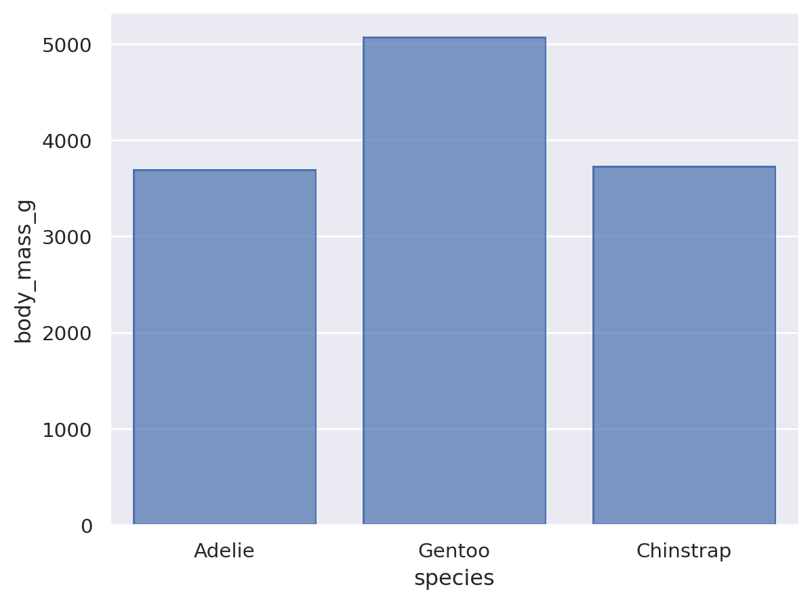

# Homework 1 Report

**Name:** Robert M. Martin Jr  
**Course:** CS 625 Data Visualization  
**Due Date:** September 7, 2025  

---

## Git and GitHub

**Q1.** What is the URL of the new GitHub repo that you created in your personal account?  

**Answer:** [https://github.com/rmmartin1207/CS_625_HW1](https://github.com/rmmartin1207/CS_625_HW1)

**Q2.** In which direction does the 'pull' command work?  

**Answer:** The `git pull` command downloads changes from the **remote repository (GitHub.com)** to the **local repository**.

**Q3.** If you committed a change on your local machine, but do not see the update on GitHub.com, what step might you have forgotten?  

**Answer:** You likely forgot to run the `git push` command, which sends your local commits to GitHub.

---

## Markdown

**Q1.** Create a bulleted list with at least 3 items. How is this different from a numbered list?  

- Item one  
- Item two  
- Item three  

Numbered lists (1., 2., 3.) imply sequence or ranking, while bulleted lists simply group related items without order.  

**Q2.** Write a single paragraph that demonstrates the use of *italics*, **bold**, ***bold italics***, `code`, and includes a [link](https://openai.com).  

This is a paragraph with *italics*, **bold**, ***bold italics***, and `inline code`. Here is also a [link to OpenAI](https://openai.com).  

**Q3.** Find an image of an animal, upload it to your repo, and insert it below.  

Or resized with HTML:  
  

---

## Tableau

**Q1.** After you have created the final bar chart displaying the data from the South region, pick one of the other regions, save the chart as an image, and include it below.  

_Description: This bar chart shows sales by product category for the East region. Technology has the highest sales, followed by Furniture and Office Supplies._  

---

## Google Colab

**Q1.** Provide the shareable link to your edited Colab notebook.  

**Answer:** [My Colab Notebook](https://colab.research.google.com/drive/1xOJg8Dcas-hnw4X8VT8acuH1s_mDdyPQ?usp=sharing))  

*(Replace `example_link` with your actual Colab shareable link.)*  

---

## Python / Seaborn

**Q1.** Insert the first scatterplot figure and describe what it shows.  

  

_Description: This scatterplot shows bill length vs bill depth of penguins. It reveals clustering patterns by species and highlights how longer bills often correspond to shallower depths. Distinct groups suggest species separation, with a few outliers visible._

**Q2.** Insert the bar chart figure and describe what it shows.  

  

_Description: This bar chart shows the average body mass for each penguin species. Gentoo penguins are heaviest on average, Chinstrap are lightest, and Adelie fall in between._

**Q3.** Remove the outer parenthesis from the second figure code. What happened?  

**Answer:** Without the outer parentheses, Python raises a syntax error. The parentheses allow implicit line continuation, so they are required when breaking chained method calls across multiple lines._

---

## Observable / Vega-Lite

**Q1.** Replace `markCircle()` with `markSquare()`. What happened?  

**Answer:** The scatterplot points changed shape from **circles to squares**. The data and axes remained identical, only the glyph used to represent each data point was altered.

**Q2.** Replace `markCircle()` with `markPoint()`. What happened?  

**Answer:** The scatterplot points changed to a **generic point marker** (a small filled symbol). Again, only the shape changed—the positions and values were the same.

**Q3.** What change is needed to swap the x and y axes?  

**Answer:** Swap the field assignments in the encoding: change `vl.x().fieldQ("Horsepower")` to `vl.y().fieldQ("Horsepower")` and `vl.y().fieldQ("Miles_per_Gallon")` to `vl.x().fieldQ("Miles_per_Gallon")`. This effectively **transposes the axes**.

**Q4.** Comment out `vl.y().fieldN("Origin"),` in the horizontal bar chart. Insert PNG below and explain.  

  

**Answer:** With the `y` encoding removed, the chart no longer separates bars by origin. Instead, all bars collapse into a **single aggregate bar** representing total counts across all origins. Vega-Lite defaults to aggregating when a categorical encoding is missing.

---

## References

- GitHub Docs: [Hello World](https://docs.github.com/en/get-started/quickstart/hello-world)  
- Git basics: [git - the simple guide](https://rogerdudler.github.io/git-guide/)  
- Markdown: [Markdown Basic Syntax](https://www.markdownguide.org/basic-syntax)  
- Markdown Cheatsheet: [adam-p/markdown-here](https://github.com/adam-p/markdown-here/wiki/Markdown-Cheatsheet)  
- Tableau Tutorial: [Get Started with Tableau Desktop](https://help.tableau.com/current/guides/get-started-tutorial/en-us/get-started-tutorial-home.htm)  
- Google Colab FAQ: [Colab FAQ](https://research.google.com/colaboratory/faq.html)  
- Seaborn: [Objects API Tutorial](https://seaborn.pydata.org/tutorial/objects_interface.html)  
- Palmer Penguins Dataset: [palmerpenguins on GitHub](https://github.com/mcnakhaee/palmerpenguins)  
- Vega-Lite Docs: [Charting with Vega-Lite](https://observablehq.com/@observablehq/vega-lite)  

*(Add any StackOverflow posts, ChatGPT conversations, or other resources you actually used.)*
